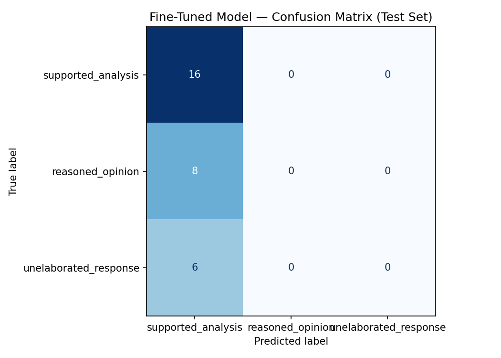

# TakeMeter

For TakeMeter, I am building a three-class text classifier to study how
participants in [r/LetsTalkMusic](https://www.reddit.com/r/LetsTalkMusic/)
support their musical claims. I designed the project to distinguish
evidence-backed discussion from general reasoning and unelaborated responses,
not to judge whether a person's musical taste is correct.

## Current Status

- I completed Milestones 1–5 and the required written evaluation for Milestone 6.
- The demo video, independent human labels, and live interface launch remain.

## Label Taxonomy

### `supported_analysis`

A response makes or answers a musical claim with concrete details, examples,
comparisons, facts, or firsthand observations and connects that support to its
conclusion.

Examples from the dataset:

- `ltm043` compares the viewing distance at a stadium and club show to explain
  why the club experience felt more special.
- `ltm181` cites releases after Disco Demolition Night to argue that disco did
  not suddenly disappear in 1979.

### `reasoned_opinion`

A response states a position, interpretation, or personal practice and gives a
distinct rationale, but does not substantiate it with concrete, checkable
detail.

Examples from the dataset:

- `ltm056` argues that mainstream and underground concerts are different
  experiences rather than one being inherently better.
- `ltm125` argues that genres are retrospective labels rather than objective
  truths.

### `unelaborated_response`

A response gives a verdict, reaction, question, acknowledgment, joke, or factual
answer without a distinct supporting rationale.

Examples from the dataset:

- `ltm071`: "Yeah they aged really well."
- `ltm187`: "Bee Gees made infinitely better music, too."

I documented my complete definitions, decision ladder, edge cases, data plan,
evaluation plan, and success criteria in [planning.md](planning.md).

## Dataset

I collected 200 public comments from ten r/LetsTalkMusic discussion threads,
with 20 comments sampled from each thread. I found no empty, deleted, removed,
or duplicate comment bodies, and I excluded usernames from the training file.

Final human-reviewed distribution:

| Label | Count | Share |
|---|---:|---:|
| `supported_analysis` | 107 | 53.5% |
| `reasoned_opinion` | 50 | 25.0% |
| `unelaborated_response` | 43 | 21.5% |

I saved the notebook-ready data in
[takemeter_labeled_data.csv](takemeter_labeled_data.csv), which contains exactly
`text`, `label`, and `notes`. I added short explanations in the `notes` column
for six difficult cases and left the other 194 note cells blank. I kept the
additional review information in the
[annotation review workbook](takemeter_annotation_review.xlsx), including label
drop-downs, difficult-case notes, provenance links, and a `human_reviewed`
status column.

## Annotation Process and Human Review

I used Codex to read and pre-label all 200 comments using the decision ladder in
`planning.md`. I documented six especially ambiguous rows in the review
workbook, notebook CSV, and `planning.md`. I then reviewed the annotations and
made minor corrections where needed.
Every row in my review workbook is marked `ai_prelabeled=yes` and
`human_reviewed=yes`, while I omitted those tracking fields from the notebook
CSV. My final distribution satisfies my planned balance requirements.

### Difficult Annotation Decisions

- **`ltm039`: `supported_analysis` or `reasoned_opinion`.** The comment is only
  one sentence, but the fact that the Sex Pistols wrote their own songs directly
  rebuts the boy-band comparison. I labeled it `supported_analysis` because the
  evidence-to-claim connection is explicit.
- **`ltm080`: `reasoned_opinion` or `unelaborated_response`.** The commenter
  suspects coordinated ICP promotion after seeing three similar posts. Three
  appearances are weak evidence, but they add a distinct rationale, so I used
  `reasoned_opinion`.
- **`ltm112`: `reasoned_opinion` or `unelaborated_response`.** The response
  describes a 100-album goal and an album-bingo board but does not explain or
  defend a claim. I used `unelaborated_response` because length and detail alone
  do not constitute analysis.

## Zero-Shot Baseline

I ran the Groq `llama-3.3-70b-versatile` model on the locked 30-comment test
set before fine-tuning. I copied the three label definitions exactly from
`planning.md` into the prompt. I used newly written examples instead of labeled
dataset examples to avoid exposing possible test examples to the baseline. The
prompt required the model to return only one exact label name.

<details>
<summary>Groq classification prompt</summary>

```text
You are classifying posts and comments from r/LetsTalkMusic according to how
they support their central point. Assign each response to exactly one label.

supported_analysis: The response makes or answers a musical claim with concrete
details, examples, comparisons, facts, or firsthand observations and connects
that support to its conclusion.
Example: The live version works better because the slower tempo leaves more
space around the vocal, making the final chorus feel larger.

reasoned_opinion: The response states a position, interpretation, or personal
practice and gives a distinct rationale, but does not substantiate that
rationale with concrete, checkable detail.
Example: I prefer the band's earlier albums because they feel more focused and
emotionally direct.

unelaborated_response: The response gives a verdict, reaction, question,
acknowledgment, joke, or factual answer without a distinct supporting rationale.
Example: Their second album is the best one.

Apply these rules in order:

1. If the response contains concrete support and explains or clearly implies
how that support answers its central point, use supported_analysis.
2. Otherwise, if it provides a distinct rationale that adds information beyond
the verdict, use reasoned_opinion.
3. Otherwise, use unelaborated_response.

A named artist, album, song, statistic, or technical term is not automatically
evidence. A list without an explanation is unelaborated_response. Firsthand
experience can be evidence when it is connected to the conclusion. Length alone
does not make a response analysis. Judge only the supplied text.

Respond with ONLY one of these exact label names:
supported_analysis
reasoned_opinion
unelaborated_response

Do not provide an explanation, punctuation, quotation marks, or Markdown.
```

</details>

| Metric | Result |
|---|---:|
| Accuracy | 0.700 |
| Macro F1 | 0.711 |
| Weighted F1 | 0.695 |
| Parseable responses | 30/30 |

The baseline had perfect precision but only 0.50 recall for
`supported_analysis`. It correctly recognized all eight `reasoned_opinion`
examples, but its precision for that class was 0.533. This pattern suggests
that it often treated supported analysis as a general reasoned opinion when the
evidence-to-claim connection was implicit. I saved the complete results in
[baseline_results.json](baseline_results.json).

## Fine-Tuning Approach

I fine-tuned `distilbert-base-uncased` in Google Colab on a T4 GPU. The notebook
created a stratified split of 140 training, 30 validation, and 30 test examples
with random seed 42. Text was truncated to 256 tokens. I kept the starter
settings of three epochs, a learning rate of `2e-5`, training batch size 16,
evaluation batch size 32, weight decay 0.01, and 50 warmup steps. I kept three
epochs because the training set was small and I wanted several passes through
the data without selecting a much longer run that could overfit.

The validation loss decreased from 1.083 after epoch 1 to 0.998 after epoch 3,
but validation accuracy remained 0.533 in every epoch. The final report uses
this original default-setting run. I did not substitute the separate
warmup-three exploratory checkpoint because it was not evaluated and was not
part of the locked comparison.

## Evaluation Report

### Overall Comparison

Both models were evaluated on the same locked 30-comment test set.

| Model | Accuracy | Macro F1 | Weighted F1 |
|---|---:|---:|---:|
| Groq zero-shot baseline | 0.700 | 0.711 | 0.695 |
| Fine-tuned DistilBERT | 0.533 | 0.232 | 0.371 |

Fine-tuning reduced accuracy by 0.167, or five fewer correct predictions out of
30. The complete comparison is saved in
[evaluation_results.json](evaluation_results.json).

### Per-Class Metrics

| Model | Label | Precision | Recall | F1 | Support |
|---|---|---:|---:|---:|---:|
| Groq baseline | `supported_analysis` | 1.000 | 0.500 | 0.667 | 16 |
| Groq baseline | `reasoned_opinion` | 0.533 | 1.000 | 0.696 | 8 |
| Groq baseline | `unelaborated_response` | 0.714 | 0.833 | 0.769 | 6 |
| Fine-tuned DistilBERT | `supported_analysis` | 0.533 | 1.000 | 0.696 | 16 |
| Fine-tuned DistilBERT | `reasoned_opinion` | 0.000 | 0.000 | 0.000 | 8 |
| Fine-tuned DistilBERT | `unelaborated_response` | 0.000 | 0.000 | 0.000 | 6 |

### Fine-Tuned Confusion Matrix

Rows are true labels and columns are predicted labels.

| True \ Predicted | `supported_analysis` | `reasoned_opinion` | `unelaborated_response` |
|---|---:|---:|---:|
| `supported_analysis` | 16 | 0 | 0 |
| `reasoned_opinion` | 8 | 0 | 0 |
| `unelaborated_response` | 6 | 0 | 0 |



The model predicted `supported_analysis` for every test example. Therefore, the
16 correct predictions reflect the majority-class share rather than a learned
ability to separate the three support levels.

### Sample Classifications

| Post excerpt | True label | Predicted label | Confidence | Result |
|---|---|---|---:|---|
| “Just as true as the Beatles made the first Hip-Hop song with ‘Cry Baby Cry’ ... check out what Ringo is doing when the 2nd verse kicks in.” | `supported_analysis` | `supported_analysis` | 0.35 | Correct |
| “Music genres aren't some universal objective truth, they're retrospective labels used to subdivide works.” | `reasoned_opinion` | `supported_analysis` | 0.36 | Incorrect |
| “It is in Europe.” | `unelaborated_response` | `supported_analysis` | 0.36 | Incorrect |
| “That's like saying Dylan's Subterranean Homesick Blues was the first rap song.” | `unelaborated_response` | `supported_analysis` | 0.36 | Incorrect |

The first prediction is reasonable because the comment points to a specific,
checkable moment in Ringo's second-verse performance and connects that musical
detail to its claim. Although its opening comparison is playful, it meets my
rule for `supported_analysis`. Its low 0.35 confidence is still important: the
model was only slightly more confident than the one-third probability of a
uniform three-class prediction.

### AI-Assisted Pattern Review

I supplied the misclassified examples, class metrics, and confusion matrix to
Codex and asked it to look for patterns involving length, sarcasm, named musical
references, factual replies, and personal anecdotes. The proposed surface
patterns initially seemed plausible: several errors were short factual replies
or jokes, while others contained artist and song names that could resemble
evidence. I checked those ideas against all 14 errors and rejected them as the
primary explanation. The errors include both short and long comments, multiple
topics, sarcasm, abstract arguments, and personal practices. More importantly,
all eight true `reasoned_opinion` examples and all six true
`unelaborated_response` examples were assigned the same majority label.

The stronger explanation is training collapse. The training split contained 75
`supported_analysis`, 35 `reasoned_opinion`, and 30
`unelaborated_response` examples. In addition, the run had only 27 optimization
steps but used 50 warmup steps, so its learning rate remained in warmup for the
entire run. Prediction confidences clustered around 0.34–0.36, close to the
one-third probability of an uninformative three-class model. Together, those
observations suggest that DistilBERT learned the class prior instead of the
intended decision boundary.

### Three Specific Failures

#### 1. Abstract rationale mistaken for concrete support

> Music genres aren't some universal objective truth, they're retrospective
> labels used to subdivide works.

- True label: `reasoned_opinion`
- Predicted label: `supported_analysis` (confidence 0.36)

The comment gives a coherent interpretation and explains the author's view of
genres, but it provides no specific musical example or checkable detail. Under
my decision ladder, that makes it a reasoned opinion. Its analytical tone could
look like supported analysis, but the global confusion matrix shows that this
was not an isolated boundary mistake: every reasoned opinion received the same
prediction. A better training set would include more short, abstract rationales
paired with supported analyses that contain concrete evidence.

#### 2. Short factual answer treated as analysis

> It is in Europe.

- True label: `unelaborated_response`
- Predicted label: `supported_analysis` (confidence 0.36)

This is an unambiguous factual answer without a supporting rationale. The error
cannot be explained by a subtle label boundary; it directly exposes the
majority-class collapse. More minority-class examples and class-balanced
training could reduce the incentive to select `supported_analysis` for a reply
that contains no argument.

#### 3. Analogy mistaken for supported analysis

> That's like saying Dylan's Subterranean Homesick Blues was the first rap song.

- True label: `unelaborated_response`
- Predicted label: `supported_analysis` (confidence 0.36)

The response is a brief analogy or joke. It mentions an artist and song, but it
does not develop those references into evidence. This is exactly why my
annotation rules state that a named artist or song is not automatically
support. Targeted counterexamples could help a trained model learn that musical
specificity and actual evidentiary support are different features.

### What I Would Change

For another properly locked experiment, I would reduce warmup to roughly 10% of
the total optimization steps, select checkpoints using macro F1 rather than
accuracy, and use class-weighted loss or balanced sampling on the training set.
I would also collect more genuine `reasoned_opinion` and
`unelaborated_response` examples, especially short rationales and named musical
references that are not evidence. Because the current test set has already been
examined, I would evaluate those changes on a newly held-out test set rather
than repeatedly tuning against these 30 examples.

## Model Reflection

I intended the classifier to learn a hierarchy of support: concrete evidence
connected to a claim, a general but distinct rationale, or no rationale. The
fine-tuned model did not capture that hierarchy. It captured the safest class
prior in the training data and treated every response as
`supported_analysis`. Its perfect recall for that class is therefore misleading
because its precision was only 0.533 and the other two classes had zero recall.

The Groq baseline came closer to my intended taxonomy because it recognized all
three classes, although it was conservative about supported analysis. The gap
between the two models shows that my definitions were usable by a general model
with broad language knowledge, but 140 training examples and the selected
training schedule were not enough for DistilBERT to learn the same distinctions.
The result also shows why accuracy alone was insufficient: 53.3% might look
better than random guessing, but the per-class metrics reveal that the model
provided no useful three-way classification behavior.

## Stretch Features

### Error Pattern Analysis

I completed a systematic analysis of all 14 errors in the
[AI-assisted pattern review](#ai-assisted-pattern-review). The verified pattern
was not one topic, length, or rhetorical style: the model assigned the majority
label to every example from both minority classes. I compared that pattern with
the training distribution, confidence range, validation plateau, and warmup
schedule rather than inferring a cause from only three selected mistakes.

### Confidence Calibration

All 30 predictions fell into the same 0.3–0.4 confidence bin. Their mean
confidence was 0.3546, while their empirical accuracy was 0.5333.

| Confidence bin | Examples | Mean confidence | Accuracy |
|---|---:|---:|---:|
| 0.3–0.4 | 30 | 0.3546 | 0.5333 |

The expected calibration error was 0.1787 and the multiclass Brier score was
0.6573. For context, uniform probabilities across three classes produce a
multiclass Brier score of about 0.6667, so the model improved only slightly over
uninformative probabilities. Mean confidence was 0.3536 on correct predictions
and 0.3558 on incorrect predictions. Incorrect predictions were therefore
slightly more confident than correct ones, and confidence could not separate
easy from difficult examples. The model never produced medium- or
high-confidence predictions, so this test cannot establish whether a nominal
60% or 90% score would be reliable. The complete calculation is saved in
[confidence_calibration.json](confidence_calibration.json).

### Deployed Gradio Interface

The repository includes [takemeter_interface.py](takemeter_interface.py), a
Gradio interface that accepts a new comment and displays the predicted label
and all three confidence scores. It uses the same 256-token truncation as the
notebook and can run against the trained checkpoint already stored in Colab.
The interface is a diagnostic classroom demonstration, not a moderation tool.

To launch it in the existing Colab session:

1. Upload `takemeter_interface.py` through the Colab Files panel.
2. Run the following cell. Gradio will display the app and, with `share=True`,
   provide a temporary public URL.

```python
import glob
from transformers import AutoModelForSequenceClassification
from takemeter_interface import launch_interface

checkpoints = sorted(glob.glob("/content/takemeter-model/checkpoint-*"))
checkpoint_path = checkpoints[-1] if checkpoints else "/content/takemeter-model"

interface_model = AutoModelForSequenceClassification.from_pretrained(
    checkpoint_path
).to("cuda")

launch_interface(
    interface_model,
    tokenizer,
    ID_TO_LABEL,
    share=True,
)
```

For a local saved checkpoint, install [requirements.txt](requirements.txt) and
run:

```bash
python takemeter_interface.py --model-dir PATH_TO_CHECKPOINT --share
```

### Inter-Annotator Reliability Preparation

I prepared a blinded, balanced 30-comment workbook for an independent second
annotator: [inter_annotator_reliability.xlsx](inter_annotator_reliability.xlsx).
It contains the definitions, decision ladder, label dropdowns, and ten examples
from each reference class without revealing my labels. This stretch feature
will be reported only after another person completes the workbook; an AI label
comparison would not satisfy the requirement for another person.

## Specification Reflection

- **How the specification guided my work:** The requirement to create a locked
  70%/15%/15% split and run the zero-shot baseline before fine-tuning gave me a
  fair evaluation sequence. Both models were measured on the same untouched
  30-comment test set, so I could attribute their difference to training rather
  than to different evaluation examples.
- **How my implementation diverged:** The specification presents LLM
  pre-labeling as an optional workflow for a batch of examples. I used Codex to
  propose labels for all 200 comments, then personally reviewed every row and
  made minor corrections. I chose this approach to apply the same decision
  ladder consistently across the dataset while keeping the final annotation
  decisions under human review.

## AI Usage

**Instance 1**

- *What I gave the AI:* I gave Codex my initial taxonomy, the
  r/LetsTalkMusic community context, and difficult boundaries involving short
  factual claims, technical vocabulary, lists, jokes, and detailed personal
  responses.
- *What it produced:* Codex stress-tested the boundaries and identified cases
  where my original `bare_assertion` label was too narrow to cover questions,
  acknowledgments, jokes, and short factual replies.
- *What I changed or overrode:* I replaced `bare_assertion` with
  `unelaborated_response` and applied my decision ladder to decide whether each
  response contained concrete support, a distinct rationale, or neither.

**Instance 2**

- *What I gave the AI:* I gave Codex my final three label definitions, decision
  ladder, and the 200 collected r/LetsTalkMusic comments.
- *What it produced:* Codex proposed one label per comment and flagged six
  difficult cases with explanations of the competing labels.
- *What I changed or overrode:* I personally reviewed every proposed label,
  made minor corrections where needed, and kept only labels that matched my
  definitions. I recorded every row as `human_reviewed=yes` and retained notes
  for the six difficult cases.

**Instance 3**

- *What I gave the AI:* I gave Codex the 14 wrong predictions, the per-class
  metrics, and the fine-tuned confusion matrix and asked it to identify common
  error patterns.
- *What it produced:* Codex proposed possible patterns involving comment
  length, sarcasm, named musical references, factual answers, and personal
  anecdotes, and also identified the across-the-board majority prediction.
- *What I changed or overrode:* I checked each proposal against all 14 errors. I
  rejected length, topic, and sarcasm as the primary explanations because the
  errors were diverse and every minority-class example failed. I retained the
  majority-collapse explanation because it matched the complete confusion
  matrix, near-uniform confidence scores, and validation plateau.

## Demo Video

I will add the demo-video link here after recording the required 3–5 minute
walkthrough. The recording will show 3–5 classifications with labels and
confidence scores, explain one correct and one incorrect prediction, and walk
through the comparison table, confusion matrix, and model reflection.
